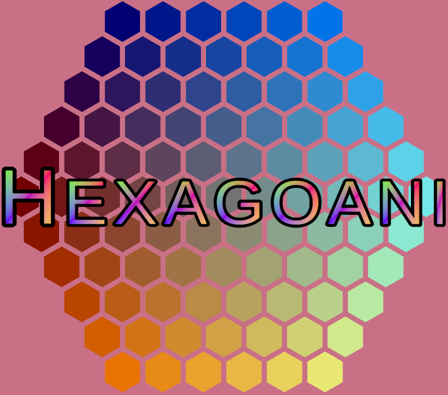

## Greetings, traveller

If you are here to see my work, have a look at these projects.

#### Content
- [Dynamic Particle Simulation on GPU](#dynamic-particle-simulation-on-gpu): Using CUDA to implement a PIC MCC simulation.
- [Zupply API](#zupply-api): Python REST-API for the Zupply company.
- [Guildmaster Digital Prototype](#guildmaster-digital-prototype): LLM-powered game developed by a diverse team.
- [Otter Knight YouTube Channel](#otter-knight-youtube-channel): Advanced programming tutorials.
- [Gorillas](#gorillas): Game and engine developed in JavaFX.
- [Hexagoani](#hexagoani): Unity game inspired by 2048.
- [Unity Utility Package](#unity-utility-package): Custom code-package for Unity.

## Dynamic Particle Simulation on GPU
https://github.com/MagnusMouritzen/particle-simulation

My bachelor project is a GPU implementation of a Particle in Cell simulation using Monte-Carlo Collisions. It is written in CUDA (C++) and is made to be run on the high-performance computers of Technical University of Denmark.

The project focuses on exploration of the performance differences of various scheduler paradigms given varying conditions. This is quantified with extensive benchmarks and NVIDIA Nsight, the results of which were extensively analysed. The simulation features random collisions with varying frequencies, dynamic addition and subtraction of particles, as well as the implementation of a grid of cells to be used with a poisson solver.

The [repository](https://github.com/MagnusMouritzen/particle-simulation) contains the report and slides from the defence. The [branch with the submitted code](https://github.com/MagnusMouritzen/particle-simulation/tree/final_branch) includes many scheduler tests showcasing basic paradigm differences.

Technologies: C++, CUDA, HPC, Python

## Zupply API
Two REST-APIs with corresponding databases and a front-end were developed for the [Zupply](https://www.zupply.site/) company. This was done as part of a university course.

I worked on the APIs and corresponding databases, but not the front-end. The databases were made in MariaDB and the APIs were written in Python using Flask.

Unfortunately I can not show any of it, as Zupply holds all the rights to the code.

Technologies: Python, Flask, SQL, MariaDB, SQLAlchemy

## Guildmaster Digital Prototype
https://otter-knight-studio.itch.io/guildmaster-demo

I led a group of developers including programmers, a security expert, writers, QA, and many playtesters to create this prototype of a game idea. It is made with C# in Unity. 

The game underwent many agile development cycles including design discussions, very rapid mini-prototypes played on paper with tokens, a larger paper-prototype tested on a dozen different players, and finally this digital prototype, which itself has gone through many cycles according to playtest results.

Its most noteworthy feature is the usage of a Large Language Model to dynamically generate dialogue between characters. This is done by communicating with an API written in Python (Flask), which is hosted on my website. Each character is represented by a fine-tuned ChatGPT model to give the characters unique mannerisms and ways of expression. The API is further utilised in editor-tools for content creation. Notably it can be used to prompt the LLM to write specific parts of a quest given the context of the quest so far.

The game furthermore features a complex personality system based on the HEXACO model, tweaked to suit gameplay needs and the fantasy theme.

I wrote all the code except for the API and direct interactions with it. I also did nearly all the Unity-relevant work. Others wrote the quests, developed the characters and their models, wrote the API and connections, generated the images (with AI), and balanced the game.

The development taught us a lot, especially about the concept of prototyping to answer specific questions. This prototype is a very bloated, general one, and did in the end take too much time for what it provides. Finally, if we were to make this into a proper game, we have now learned of many ways in which it should be changed.

Technologies: C#, Unity, Python, Flask, ChatGPT

## Otter Knight Youtube Channel
https://www.youtube.com/@Otter_Knight

Advanced Unity programming tutorials on [Editor Scripting in Unity](https://youtube.com/playlist?list=PLqy--wDEnoVIxVmP_V6RXFg-tc9mVlFgX&si=iGU2nAX2CtD7KK_A) as well as one on [Bit Manipulation](https://youtu.be/gZLhh9uJNAs?si=BP0BRAzJ-4IQciLA).

The channel was started with a friend. For all the videos, I planned them, made the code and projects, wrote the audio script, edited the audio, recorded the visuals, and usually also recorded the audio. My friend handled all the video editing and recorded the audio for one of them.

The code for all the [Editor Scripting videos](https://youtube.com/playlist?list=PLqy--wDEnoVIxVmP_V6RXFg-tc9mVlFgX&si=iGU2nAX2CtD7KK_A) can be found [here](https://github.com/MagnusMouritzen/unity-editor-scripting).

Technologies: C#, Unity, Reaper

## Gorillas
https://github.com/MagnusMouritzen/gorillas

A simple game engine inspired by Unity was developed in Java. It features common game design patterns such as an Update loop and a Component system, and a very simple collision and "rendering" system. The engine was then used with JavaFX to create a game inspired by the classic Gorillas.

The project was part of a three-week university course where I worked with two others. I primarily worked on the engine and the implementation of the game itself. I barely touched the GUI.

Technologies: Java, JavaFX

## Hexagoani
https://otter-knight-studio.itch.io/hexagoani

https://github.com/MagnusMouritzen/hexagoani

This small project is a hexagonal version of the mobile game 2048. It is made completely by myself in Unity.

For me, the most interesting part was the implementation of the Hexagon data structure.

Technologies: C#, Unity, Reaper

## Unity Utility Package
https://github.com/MagnusMouritzen/utility-package

This is a collection of C# code I often use in various Unity project. It is structured such that it can be imported to Unity as a package.

Much of it is classes with associated property drawers, some of them from my Youtube channel. The rest is mostly useful static methods.

Technologies: C#, Unity
